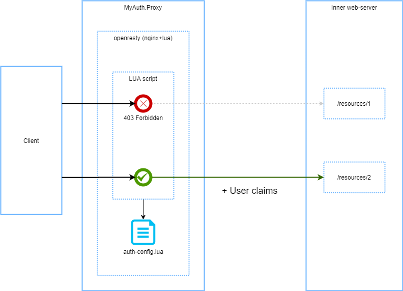

# MyAuth.Proxy 


`Docker` образ `nginx` (`openresty`) + `myauth`: [](https://hub.docker.com/r/ozzyext/myauth-proxy)

`LuaRocks`: [](https://luarocks.org/modules/ozzy-ext/myauth)


Ознакомьтесь с последними изменениями в [журнале изменений](/changelog.md).

## Обзор

Серверное приложение, осуществляющее контроль доступа к HTTP-ресурсам. 

Позволяет осуществлять контроль:

* анонимного доступа;
* доступа с `Basic` аутентификацией;
* доступа по ключам с `JWT` токенами.

После успешной авторизации запрос к ресурсу снабжается заголовком авторизации с открытой схемой аутентификации [MyAuth](https://github.com/ozzy-ext-myauth/specification), указанной в конфигурации. А так же, другими заголовками, если они предусмотрены выбранной схемой аутентификации.

На схеме ниже отражена концепция работы сервиса.



## Настройки авторизации

### Файл

Файл, содержащий настройки доступа к перечисленным `URL` в формате `LUA`. Содержание файла - присвоение переменным с фиксированными именами значений заданной структуры с данными об авторизации перечисленных `URL`.

Пример конфигурации:

```lua
debug_mode=true

dont_apply_for = {
	"/free_for_access"
}

only_apply_for = {
	"/"
}

black_list = {
	"/blocked"
}

anon = {
	"/pub"
}

basic = {
	{
		id = "user-1",
		pass = "user-1-pass",
		urls = {
			"/basic-access-[%d]+",
			"/basic-access-a"
		}
	},
	{
		id = "user-2",
		pass = "user-2-pass",
		urls = {
			"/basic-access-[%d]+"			
		}
	},
	{
		id = "user-2",
		pass = "user-2-pass",
		urls = {
			"/basic-access-2"			
		}
	}
}

rbac = {
	ignore_audience = false,
	rules = {
		{
			url = "/rbac-access-[%d]+",
			allow = { "role-1", "role-2" },
			deny = { "role-3", "role-4" },
			allow_get = { "role-5"  },
			deny_post = { "role-1"  }
		},
		{
			url = "/rbac-access-2",
 			allow_for_all = true
		}
	}
}
```

* `debug_mode` - `true`/`false`, устанавливает режим отладки. Подробнее о режиме отладки - ниже, в разделе [Отладка](##Отладка).
* `output_scheme` - исходящая схема аутентификации, используемая для передачи утверждений пользователя при доступе к ресурсу. Доступные значения:
  * [MyAuth1](https://github.com/ozzy-ext-myauth/specification/blob/master/v1/myauth-authentication-1.md) (по умолчанию)
* `dont_apply_for` - массив [шаблонов](https://www.lua.org/pil/20.2.html) `URL`, к которым не будет применяться авторизация;
* `only_apply_for` - массив [шаблонов](https://www.lua.org/pil/20.2.html) `URL`, к которым будет применяться авторизация. По умолчанию - ко всем; 
* `black_list` -  массив [шаблонов](https://www.lua.org/pil/20.2.html) `URL`, к которым будет запрещён доступ;
* `anon` - массив [шаблонов](https://www.lua.org/pil/20.2.html)`URL`, к которым будет предоставлен анонимный доступ;
* `basic` - массив пользователей, для которых доступна `basic`-авторизация и параметры их доступа:
  * `id` - идентификатор пользователя, используемый при формировании значения заголовка `Authentication`;
  * `pass` - пароль пользователя в открытом виде, используемый при формировании значения заголовка `Authentication`;
  * `urls` - массив [шаблонов](https://www.lua.org/pil/20.2.html) `URL` целевых ресурсов;
* `rbac` - настройки доступа на основе ролей при аутентификации с токеном доступа:
  * `ignore_audience` - флаг, отключающий проверку `audience` токена; `false` - по умолчанию;
  * `rules` - массив правил
    * `url` - [шаблон](https://www.lua.org/pil/20.2.html) `URL` целевого ресурса;
    * `allow_for_all` - `true`/`false`, устанавливает разрешение доступа для любой роли; По сути - доступ для любого авторизованного пользователя;
    * `allow` - массив ролей пользователей, которым разрешён доступ к целевому ресурсу без учёта `http`-метода;
    * `deny` - массив ролей пользователей, которым запрещён доступ к целевому ресурсу без учёта `http`-метода;
    * `allow_get` - массив ролей пользователей, которым разрешён доступ к целевому ресурсу с `http`-методом `GET`. Аналогично, для любого `http`-метода;
    * `deny_get` - массив ролей пользователей, которым запрещён доступ к целевому ресурсу с `http`-методом `GET`. Аналогично, для любого `http`-метода;

### Секреты

Файл с секретами должен располагаться на хост-сервере и подключаться в контейнер по пути `/app/configs/auth-secrets.lua`

Формат файла - `LUA` скрипт с объявлением переменных.

Пример:

```lua
jwt_secret = "some-secret"
```

* `jwt_secret` - ключ для проверки подписи `JWT` токена по алгоритму `HS256`.

### Шаблоны 

Шаблоны `URL` - не регулярные выражения, а имеют специальный LUA-формат для шаблонов. [Оф документация](https://www.lua.org/pil/20.2.html). 

Важной особенностью шаблонов конфигурации является возможность не экранировать дефис (`-`). Т.е. при написании шаблона для `/some-resource` пришлось бы писать `/some%-resource`, но именно в этом конфигурационном файле этого можно не делать. Это сделано для удобства, потому что дефис (`-`) часто встречается в `URL`.

### Порядок проверки доступа

Общий алгоритм:

* если найдено совпадение в `black_list` - **отказ**;
* если найдено совпадение в `dont_apply_for` - **разрешение**;
* если объявлен список `only_apply_for` и в нём нет совпадений - **отказ**;
* если нет заголовка `Authorization`, то используются правила `anon`:
  * если найдено совпадение в `anon` - **разрешение**;
  * иначе - **отказ**;
* если авторизация `Basic`, то используются правила `basic`:
  * если нет совпадений по пользователю - **отказ**;
  * если есть совпадение по имени пользователя, то используются настройки этого пользователя;
    * если найдено совпадение в списке `urls` - **разрешение**;
    * иначе - **отказ**;
* если авторизация `Bearer`, то используются правила `rbac`:
  * если нет совпадений в `roles` по полю `url` - **отказ**;
  * если есть совпадения, то происходит вычисление разрешения по всем совпадениям по следующим правилам:
    * в каждом совпадении проверяется `allow_for_all`. Если хотя бы в одном этот параметр установлен в `true`, то есть разрешающий фактор;
    * в каждом совпадении ищутся роли пользователя в `allow` и `allow_xxx` (в соответствии с `http`-методом). Если найдены, то есть разрешающий фактор;
    * в каждом совпадении ищутся роли пользователя в `deny` и `deny_xxx` (в соответствии с `http`-методом). Если найдены, то есть запрещающий фактор;
    * если есть хотя бы один запрещающий фактор, то - **отказ**;
    * если есть хотя бы один разрешающий фактор, то - **разрешение**;
    * в противном случае (нет ни разрешений, ни запрещений) - **отказ**;
* в противном случае (другой тип авторизационных данных в заголовке `Authorization`) - **отказ**.

## Развёртывание

### На базе готового docker-образа

В данном разделе описывается развёртывание с использованием `docker`-контейнеров. Образы сервиса зарегистрированы в реестре образов [docker-hub](https://hub.docker.com/r/ozzyext/myauth-proxy).

Для настройки работы сервиса необходимо определить следующие параметры:

* настройки авторизации: файл `/app/configs/auth-config.lua` в контейнере;
* адрес целевого сервера `TARGET_SERVER`, куда будут перенаправляться авторизированные запросы.

Опционально можно настроить:

* настройки `nginx` локации по умолчанию: `/etc/nginx/snippets/default-location.conf`
* файл с секретами: `/app/configs/auth-secrets.lua`

* подпись сервиса в случае отрицательного ответа (`400` `401` `403` `404` `500` `502` `504`):
  * помещается в заголовок `X-Source` ответа;
  * `myauth-proxy` - по умолчанию
  * устанавливается через переменную окружения `SERVICE_SIGN`

Пример развёртывания сервиса:

```bash
docker run --rm \ 
	-p 80:80 \
	-v ./auth-config.lua:/app/configs/auth-config.lua \
	-v ./secrets.lua:/app/configs/auth-secrets.lua \
	-v ./default-location.conf:/etc/nginx/snippets/default-location.conf \
	-e TARGET_SERVER=target-host.com \
	-e SERVICE_SIGN=facade-auth-proxy \
	ozzyext/myauth-proxy:latest
```

#### Конфигурация локации по умолчанию

Файл, содержащий инструкции в формате `nginx` и загружается из пути `/etc/nginx/snippets/default-location.conf` контейнера. Встраивается в конфигурацию корневой локации сервера по умолчанию во внутреннем `nginx`:

 ```nginx
server {
	listen 80;
	server_name default_server;

	location / {

		proxy_pass http://target-server;

		# authorization here

		include snippets/default-location.conf # <-- HERE IS !!!
	}
}
 ```

### Собственный сервис авторизации 

Собственный сервис авторизации с использованием библиотеки `myauth` - это `nginx` с поддержкой `LUA` в котором используется `LUA`-библиотека `myauth` для авторизации доступа к локациям.

Дальнейшее изложение подразумевает развёртывание собственного сервиса авторизации на базе `docker`.

#### Docker образ

 Рекомендации по разработке `docker`-образа собственного сервиса авторизации:

* использовать образ [openresty](https://hub.docker.com/r/openresty/openresty/) в качестве базового образа

  ```dockerfile
  FROM openresty/openresty
  ```

  или для фиксации номера версии (пример для `centos`)

  ```dockerfile
  FROM openresty/openresty:1.15.8.3-centos
  ```

* установить `git` и `gcc` для сборки библиотеки и зависимостей (пример для `centos`)

  ```dockerfile
  RUN yum -y install git gcc
  ```

* установить библиотеку `myauth`

  ```dockerfile
  RUN /usr/local/openresty/luajit/bin/luarocks install myauth
  ```

  или для фиксации номера версии

  ```dockerfile
  RUN /usr/local/openresty/luajit/bin/luarocks install myauth 1.8.6
  ```

#### Конфиг nginx

Рекомендации по разработке конфигурационного файла `nginx` с использованием `myauth`:

* на уровне http разместить блок инициализации

  ```nginx
  init_by_lua_block {
  	
  	local config = require "myauth.config".load("/app/configs/auth-config.lua")
  	local secrets = require "myauth.secrets".load("/app/configs/auth-secrets.lua")
  
  	a = require "myauth"
  	a.initialize(config, secrets)
  }
  
  server {
  	....
  }
  ```
  
* на уровне локаций, в которых необходимо проверять авторизацию, добавить код:

  ```nginx
  location / {
  
      access_by_lua_block {
      	a.authorize()
      }
      proxy_pass http://...;		
  }
  ```

## API

### myauth.config

#### load(filepath)

Загружает файл конфигурации `myauth` из файла `filepath`.

```lua
local cfg = require "myauth.config"
local mycfg = cfg.load('/path/to/cfg.lua')
```

#### load(filepath, base_config)

Загружает файл конфигурации `myauth` из файла `filepath` и объединяет его с ранее загруженным конфигом `base_config`.

```lua
local cfg = require "myauth.config"
local mycfg = cfg.load('/path/to/cfg.lua')
mycfg = cfg.load('/path/to/cfg-2.lua', mycfg)
```

Объединение происходит по следующему принципу:

* `debug_mode` - переопределяется последующим конфигом, если значение указано 
* `output_scheme` - переопределяется последующим конфигом, если значение указано
* `dont_apply_for` - объединение массивов
* `only_apply_for` - объединение массивов
* `anon` - объединение массивов
* `black_list` - объединение массивов
* `basic` - объединение массивов
* `rbac.ignore_audience` - переопределяется последующим конфигом, если значение указано 
* `rbac.rules` - объединение массивов

#### load_dir(dirpath)

Загружает и объединяет файлы конфигурации `myauth` из директории `direpath`

```lua
local cfg = require "myauth.config"
local mycfg = cfg.load('/path/to/cfg.lua')
mycfg = cfg.load('/path/to/cfg-2.lua', mycfg)
```

Объединение происходит как в случае `load(filepath, base_config)`

### myauth.secrets

#### load(filepath)

Загружает файл с секретами`myauth` из файла `filepath`.

```lua
local secrets = require "myauth.secrets".load('/path/to/secrets.lua')
```

### myauth

#### initialize(init_config, init_secrets)

Инициализирует модуль авторизации.

```lua
local config = require "myauth.config".load("/app/configs/auth-config.lua")
local secrets = require "myauth.secrets".load("/app/configs/auth-secrets.lua")

a = require "myauth"
a.initialize(config, secrets)
```

 #### authorize()

Авторизирует текущий запрос `nginx`

```nginx
server {
	
    ...
    
	location / {
    
		access_by_lua_block {

			a.authorize()
		}
		proxy_pass ...;		
	}
}
```

## Отладка 

Режим отладки позволяет получить более подробную информацию о процессе авторизации внутри прокси из текущего запроса. В режиме отладки:

* содержательная часть отрицательных ответов содержат раскрытую причину отказа;
* ответ содержит отладочные заголовки с дополнительной информацией.

Для включения режима отладки укажите в конфигурации 

```lua
debug_mode=true
```

### Отладочные заголовки

Отладочные заголовки передаются в ответе от прокси авторизации и предназначены для отладки процесса авторизации в прокси.

#### Пример с успешной авторизацией

```
"x-debug-authorization-header": "MyAuth2",
"x-debug-rbac": "{\"roles\":[\"User3\"],\"url\":\"\\\/rbac-access-1\",\"method\":\"GET\",\"rules\":[{\"total_factor\":true,\"allow_get\":\"User3\",\"pattern\":\"\\\/rbac-access-[%d]+\"}]}",
"x-debug-claim-user-id": "0cec067f8dac4d189551202406e4147c",
"x-debug-claim-myauth-clime": "ClimeVal",
"x-debug-claim-roles": "User3",
```

`x-debug-rbac`:

```json
{
  "roles": [
    "User3"
  ],
  "url": "\\/rbac-access-1",
  "method": "GET",
  "rules": [
    {
      "total_factor": true,
      "allow_get": "User3",
      "pattern": "\\/rbac-access-[%d]+"
    }
  ]
}
```

#### Пример, когда отказано в доступе

```
"x-debug-rbac": "{\"roles\":[\"User2\"],\"url\":\"\\\/rbac-access-1\",\"method\":\"GET\",\"rules\":[{\"total_factor\":false,\"pattern\":\"\\\/rbac-access-[%d]+\",\"deny\":\"User2\"}]}",
"x-debug-msg": "No allowing rules were found for bearer",
```

`x-debug-rbac`:

```json
{
  "roles": [
    "User2"
  ],
  "url": "\\/rbac-access-1",
  "method": "GET",
  "rules": [
    {
      "total_factor": false,
      "pattern": "\\/rbac-access-[%d]+",
      "deny": "User2"
    }
  ]
}
```

#### X-Debug-Authorization-Header

Содержит значения заголовка `Authorization` запроса, перенаправленного к запрашиваемому ресурсу.

#### X-Debug-Rbac

Передаёт `json`-объект, содержащий данные о проверке авторизации на базе ролей.

Пример содержания заголовка:

```json
{
  "roles": [
    "User1"
  ],
  "url": "\\/rbac-access-1",
  "method": "POST",
  "rules": [
    {
      "total_factor": false,
      "allow": "User1",
      "deny_post": "User1",
      "pattern": "\\/rbac-access-[%d]+"
    }
  ]
}
```

#### X-Debug-Claim-...

Добавляются только при исходящей аутентификации `MyAuth2`. Они содержат значения соответствующих заголовков `X-Claim-...` в перенаправленном запросе.

#### X-Debug-Msg

Передаёт сообщение от логики авторизации, поясняющее статус ответа.

## Особенности реализации схем аутентификации

### MyAuth v1

#### Basic

При `Basic` аутентификации, в результирующий заголовок авторизации попадает только идентификатор пользователя под именем `sub`(subject, по аналогии с тем, как этот параметр называется в `jwt`). Пример заголовка авторизации для пользователя `foo-user`:

```
Authorization: MyAuth1 sub="foo-user"
```

#### Bearer

При `Bearer` аутентификации с `jwt` токеном, все утверждения из токена попадают в заголовок авторизации со своими именами.

### MyAuth v2

#### Basic

При `Basic` аутентификации, кроме заголовка авторизации, добавляется только заголовок с идентификатором пользователя `X-Claim-User-Id`. Пример заголовка авторизации для пользователя `foo-user`:

```
Authorization: MyAuth2
X-Claim-User-Id: foo-user
```

#### Bearer

##### Имена заголовков

При `Bearer` аутентификации с `jwt` токеном, кроме заголовка авторизации, все утверждения из токена добавляются в перенаправленный запрос в виде заголовков с префиксом `X-Claim-<нормализованный_тип_утверждения>`. 

Нормализация типа утверждения:

* заменяет разделитель `:` на `-`;
* первые буквы разделённых слов переводи в верхний регистр.

Пример утверждений:

```
MyClaim1 = val1
myClaim2 = val2
my-claim-3 = val3 
my:claim:4 = val4
```

Заголовки перенаправленного запроса по этим утверждениям:

```
Authorization: MyAuth2
X-Claim-MyClaim1: val1
X-Claim-MyClaim2: val2
X-Claim-My-Claim-3: val3
X-Claim-My-Claim-4: val4
```

##### Зарезервированные заголовки

Для следующих утверждений используются фиксированные имена заголовков:

* `sub` -> `X-Claim-User-Id`;
* `roles` -> `X-Claim-Roles`;
* `role` -> `X-Claim-Role`;
* `http://schemas.microsoft.com/ws/2008/06/identity/claims/role` -> `X-Claim-Role`;

##### Утверждения-массивы

Утверждения-массивы из `jwt` токена сериализуются в строку, где значения массива разделены запятыми. 

Пример: 

```
Authorization: MyAuth2
X-Claim-Roles: admin,user
```

